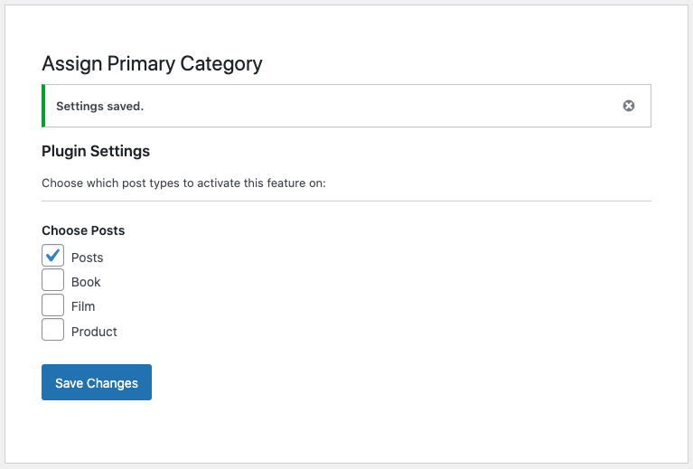

### Wordpress Plugin

# Assign Primary Categories

A Simple plugin to assign a Primary Category or Taxonomy to a post or custom post type.

## Features

- Compatible with Gutenberg and Classic Editor
- Compatible with Posts and Custom Post Types
- Compatible with multiple custom Taxonomies
- Enabled/disable for posts and custom posts via Settings > Primary Category Options

## Usage

Enable for your post types at _Settings > Primary Category Options_



### Default Categories

```
$primary_category_id = get_post_meta(get_the_ID(), 'apc_primary_category', true);

$primary_category_name = get_term($primary_category_id)->name;
```

### Custom Taxonomies

The meta key for taxonomies is saved as apc-primary\_ _< your-taxonomy-slug>_

```
$primary_taxonomy_id = get_post_meta(get_the_ID(), 'apc_primary_< your-taxonomy-slug>', true);

$primary_taxonomy_name = get_term($primary_taxonomy_id)->name;
```

> Utilises the Wordpress Plugin Boilerplate -
> a standardized, organized, object-oriented foundation for building high-quality WordPress Plugins. https://github.com/DevinVinson/WordPress-Plugin-Boilerplate.
